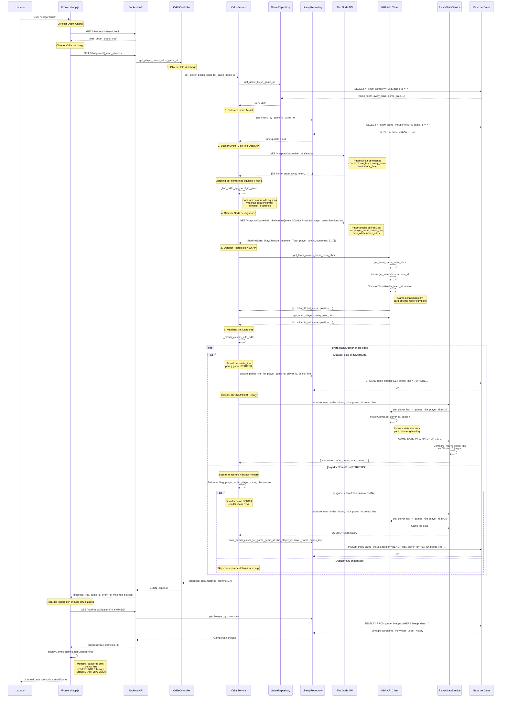

# Diagrama de Secuencia: Flujo "Cargar Odds"

## Información que se obtiene de cada API

### The Odds API
- **Endpoint 1:** `GET /v4/sports/basketball_nba/events`
  - **Información obtenida:**
    - `id`: Event ID único
    - `home_team`: Nombre del equipo local
    - `away_team`: Nombre del equipo visitante
    - `commence_time`: Fecha y hora del juego
    - `sport_key`: "basketball_nba"

- **Endpoint 2:** `GET /v4/sports/basketball_nba/events/{event_id}/odds?markets=player_points&regions=us`
  - **Información obtenida:**
    - `bookmakers`: Lista de casas de apuestas
      - `key`: "fanduel"
      - `markets`: Lista de mercados
        - `key`: "player_points"
        - `outcomes`: Lista de jugadores
          - `description`: Nombre del jugador
          - `name`: "Over" o "Under"
          - `point`: Línea de puntos (points_line)
          - `price`: Odds (american format)

### NBA API (stats.nba.com)
- **Endpoint 1:** `CommonTeamRoster(team_id, season)`
  - **Información obtenida:**
    - `PLAYER_ID`: ID oficial de la NBA
    - `PLAYER`: Nombre completo del jugador
    - `POSITION`: Posición (PG, SG, SF, PF, C)
    - `NUM`: Número de camiseta
    - `TEAM_ID`: ID del equipo

- **Endpoint 2:** `PlayerGameLog(player_id, season)`
  - **Información obtenida:**
    - `GAME_DATE`: Fecha del juego
    - `MATCHUP`: Rival (ej: "LAL vs. BOS")
    - `PTS`: Puntos anotados
    - `MIN`: Minutos jugados
    - Otros estadísticas del juego

### Base de Datos Local
- **Tabla: `games`**
  - `game_id`: ID único del juego
  - `home_team`: Abreviación equipo local
  - `away_team`: Abreviación equipo visitante
  - `home_team_name`: Nombre completo equipo local
  - `away_team_name`: Nombre completo equipo visitante
  - `game_date`: Fecha del juego
  - `game_time`: Hora del juego

- **Tabla: `game_lineups`**
  - `game_id`: ID del juego
  - `team_abbr`: Abreviación del equipo
  - `position`: Posición (PG, SG, SF, PF, C, o BENCH-{id})
  - `player_id`: ID del jugador (NBA oficial o FantasyNerds)
  - `player_name`: Nombre del jugador
  - `player_status`: "STARTER" o "BENCH"
  - `points_line`: Línea de puntos de las odds
  - `over_under_history`: JSON con historial OVER/UNDER
  - `player_photo_url`: URL de foto del jugador

- **Tabla: `team_depth_charts`**
  - `team_abbr`: Abreviación del equipo
  - `season`: Temporada
  - `player_id`: ID oficial de la NBA
  - `player_name`: Nombre del jugador
  - `position`: Posición
  - `depth`: Profundidad en el roster

